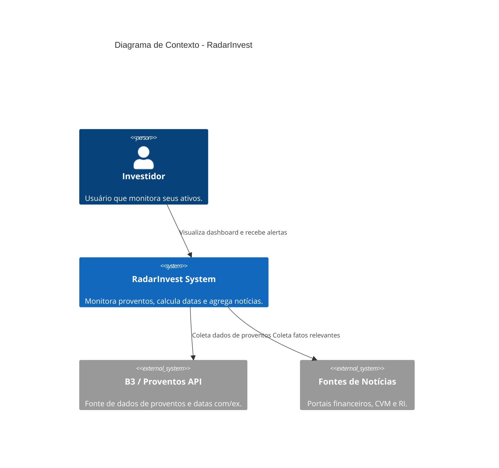
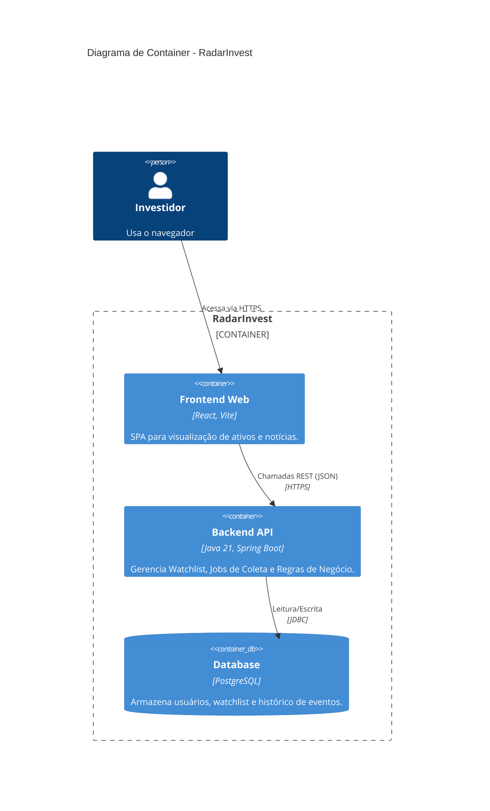

# RadarInvest - Arquitetura (V1.0)

## Visão Geral (C4 Context)

## Containers (C4 Container)

## Fluxo de Agentes Internos
O Backend é subdividido em responsabilidades de "Agentes" lógicos:
1. **AgendadorColeta**: Acorda diariamente.
2. **ColetaProventosService**: Itera sobre a Watchlist -> Chama `ProventosProvider`.
3. **MonitorNoticiasService**: Itera sobre a Watchlist -> Chama `NoticiasProvider` -> Deduplica Hash -> Salva DB.
