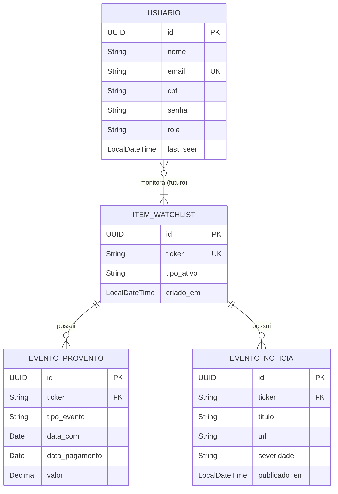

# Database Schema - RadarInvest

## Estratégia
- **Banco**: PostgreSQL 15+
- **Migrations**: Flyway (integrado ao Spring Boot)
- **Schema**: `public`

## Diagrama ER (Entity-Relationship)

## Detalhes das Tabelas

### `usuario`
Armazena os dados de autenticação e perfil dos usuários.
- `id`: Identificador único (UUID).
- `email`: Chave natural para login.
- `role`: Perfil de acesso (`USER`, `ADMIN`).

### `item_watchlist`
Ativos que estão sendo monitorados pelo sistema. Atualmente global (V1), mas preparado para ser vinculado a usuários na V2.
- `ticker`: Código do ativo na bolsa (ex: PETR4).

### `evento_provento` & `evento_noticia`
Tabelas de cache/histórico para eventos relacionados aos ativos.
- O campo `ticker` atua como chave estrangeira lógica para `item_watchlist`.

